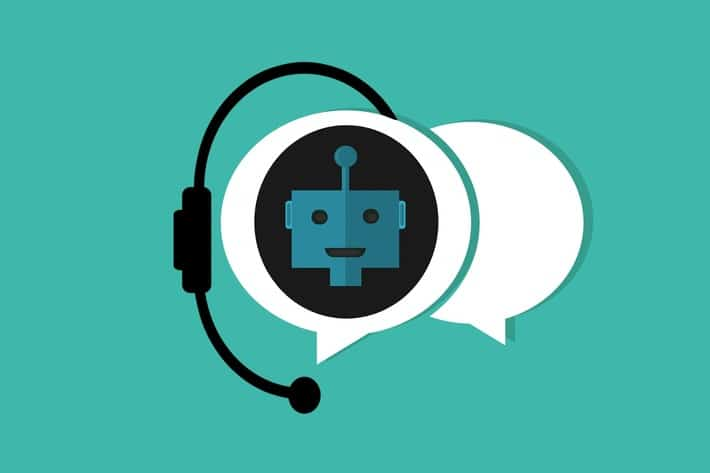
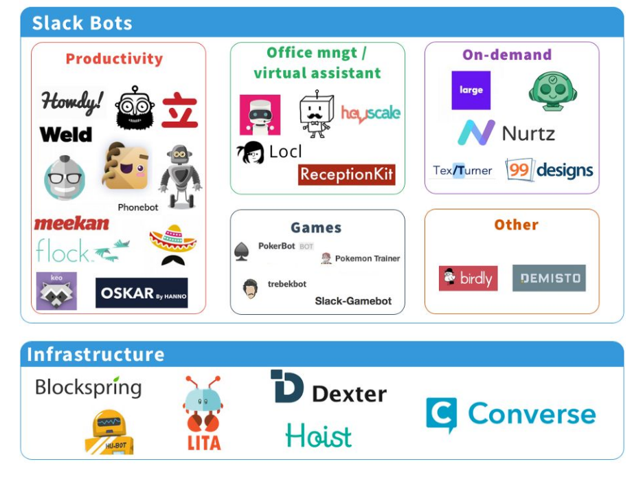
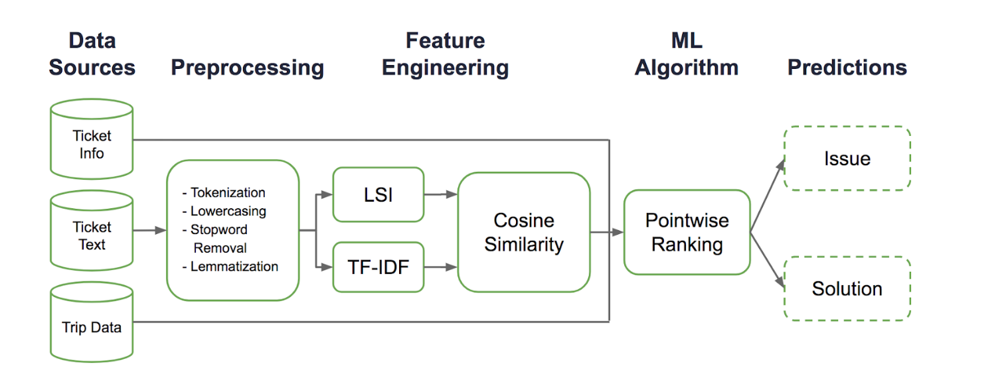
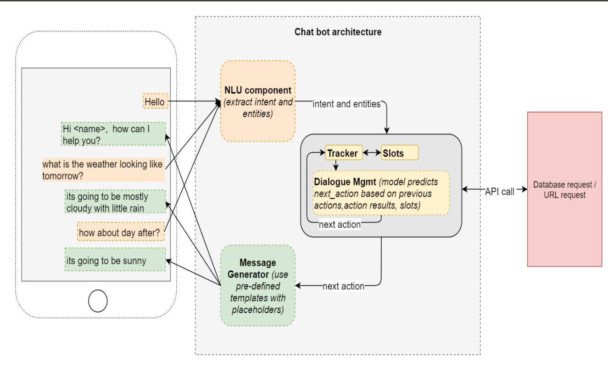

<h1>CHATBOT  For Railway Ticket Reservation  
 </h1>

<h4> a CHAT BOT Built  From Scratch </h4>

 > Interactive Railway Reservation -  Building a ChatBot for a railway reservation system. The Bot   maintains a conversation with the user regarding the booking of ticket, source and destination, general FAQs etc.

 >SPECIAL FEATURES INCLUDED FOR THIS BOT ARE:

  *  SPEECH RECOGNITION
  *  CUSTOMIZED THRESHOLD FOR THE MODEL. 
  *  SENTIMENT ANALYSIS .

  <h2> BackGround and Signifcance of ChatBots in Railway Ticket Reservation System</h2>

* Chatbots are creeping slowly into even the most boring of business interactions. They already started to rule over the low stakes mass market, over simplifying your everyday tasks. From ordering food or query your laptop service to even your credit card queries. 

* A chatbot is an artificial intelligence (AI) software that can simulate a conversation (or a chat) with a user in natural language  through messaging applications, websites, mobile apps or through the telephone.

*  Railway services are available in most of the countries in the world. However, the demand for fast, reliable, and passenger friendly services is always being felt. With the ever increasing passenger and freight loads, more efficient mechanisms are needed to handle this increasing demand. And this would not be of only man-power but of smart technologies which when induced within the system, would produce a smarter railway system throughout.

*  Indian Railway, the largest employer in India and one of the slowest service providers in terms of train inquiries and ticket booking, may choose the chatbot route for faster response.The inclusion of AI technology via chatbot in customer service is the need of the hour and the world of smartphones and smart devices can help the country to adopt it quickly.Not only for Indian Railways ,many countries need to adapt AI to maintain a good user engagement system.

 

<h2>  Implementation Framework  </h2>
 
 
<b> SOFTWARE REQUIREMENTS </b>

 *  Tensflow Frame Work, NLTK Library.

 <h2> Solution Approach </h2>

* <b>Overview:​</b> Using NLP to train the model , Speech Recognition for output.
My Approach has ​ sentiment analysis ​ which is used to improve the performance of chatbot by
analysing customer Experience.

>Chatbot’s main function is called to take response from user , sent to model ,matched intents and patterns and returned the expected response to user.

* If user selected to speak then, Speech to text
function activated , text is sent to bot.​ ​ From the conversation of user with bot ,​ Punkt​ Sentence
Tokenizer divides a text into a list of sentences, by using an unsupervised algorithm to build a
model for abbreviated words, collocations, and words that start sentences. ​ Stemming and
Lemmatization is used to generate the root form of inflected words. In this Approach I have
just used basic libraries for the framework and lemmatization,intents and pattern matching is
done from scratch .

* After tokenization ,I Created words, classes and documents added each word to a list ,and
neglected question marks,exclamation symbols as they are not necessary and useful data is
added to documents in our corpus and classes added to our classes list. From the list words
applied stemming and also removed duplicate words. Classifying the ​ intents ​ for efficient query
handling.

> Shuffle features and turned into np.array,Building Neural network using TENSORFLOW
FRAMEWORK and Training the Model using ​ Gradient Descent Algorithm.

* After Training the model ,imported json file consisting of intents and responses to model, created
a data structure to hold the user query ,generated ​ probability a ​ nd predictions below threshold to
return tuple of intents and probabilities. (Includes scratch implementation of TF-IDF and cosine
Similarity).

* FeedBack from The user is taken and Sentiment Analysis is done to improve the Performance of The Chatbot.

<h2> Thank You :D </h2>

<i>I have used many online resources while creating the application and I would like to thank them</i> . &nbsp; Hope you found it insightful.If you have any queries you can mail me at : <b> kumartharun435@gmail.com </b>. I would love to hear feedback from you to improvise it and make it better! 

